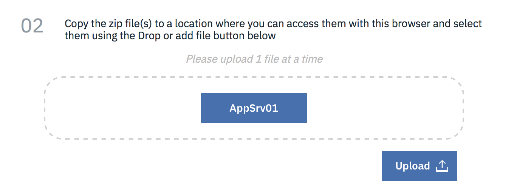

# IBM Client Developer Advocacy App Modernization Series

## Lab - Migrating Legacy JEE apps to Kubernetes

### Working with IBM Cloud Transformation Advisor

## Overview

The IBM Cloud Transformation is a developer tool available on IBM® Cloud Private. It can quickly evaluate your on-premises applications for rapid deployment on WebSphere Application Server and Liberty on public or private cloud environments.

Transformation Advisor supports legacy applications running on the following platforms:

- WebSphere Application Server
- JBoss AS
- Oracle Web Logic
- Apache Tomcat
- Plain Old Java Objects running in a JVM

In this short lab you'll run Transformation Advisor against the data collected from an instance of WebSphere Application Server V8.5.5 and examine the recommendations provided for a different Java EE applications. You'll  then look at the artifacts generated for one  those apps (the later version of the WebSphere sample app Plants By WebSphere)  for deployment on a Liberty container running in Kubernetes using the migration bundle  generated for this app by Transformation Advisor.

### Step 1: Launch Transformation Advisor and import data collected from  WebSphere Application Server

Transformation Advisor organizes your legacy server scans into workspaces and collections. Specific server scans are typically put into to separate collections. You'll use a completed server scan as a starting point for the lab

1. Download the server scan by right clicking on [this link](https://github.com//IBMAppModernization/app-modernization-ta-explore-lab/raw/master/ta/AppSrv01.zip) and selecting **Save Link As** from the context menu to save the file locally.

2. Login in to Transformation Advisor using the URL and credentials provided to you by your instructor

3. Click on **Add a new workspace**

4. Enter a unique name for your workspace e.g. `usernnn_ta_workspace` where `usernnn` is your assigned  user ID (e.g. `user011`)

5. Click **Next** and enter a name for the collection e.g. `lab_collection`

6. Click **Let's go**

7. At this point you have the option of downloading a data collection script for your legacy server to collect the data about all the installed applications or upload the results of a data collection script. Click **Upload data** then click **Drop or Add File** and select the file **AppSrv01.zip** you downloaded previously.

    

8. Click **Upload** to upload the file

9. You should be presented with a summary of recommendations for 4 applications running on the WebSphere Application Server instance where the data collection script was run.

   

### Step 2: Explore the report generated by Transformation advisor

1. Lets look at the apps designated with red to indicate that changes to the app are required before running the app on WebSphere Liberty. Click on the link for the app **petstore-WAS.ear**. This is a Java EE 5 app written by the Java BluePrints program that validates several Java EE 5 features.

    

2. Scroll down to the bottom of the page and click on **Analysis Report**. Click **OK** when prompted.

3. The analysis will open up in a new browser tab. Scroll down to the section with title **Detailed Results by Rule** and click on **Show rule help** next to the rule named **The JSF SunRI engine was removed** to see more details about what needs to be fixed to migrate the Java Pet Store app to WebSphere Liberty running on ICP. Take a look at some of the  other information in the report to get a feel for what type of information to expect when running Transformation Advisor against your own legacy Java EE apps.

    

4. Go back to the **IBM Transformation** browser tab and click on **<- Recommendations** to go back to the list of apps.

    

5. This time take a look at one of the "show stoppers" for the app **plants-by-websphere-jee5.ear** by selecting the app and then clicking on the Analysis Report link. This version of the  WebSphere sample Plants by WebSphere was shipped with WebSphere Application Server V7.0. Two  of the  three severe issues have to do with no support for the JAX-RPC API in Liberty. Note: with the explosion of REST based APIs, technologies like JAX-RPC and SOAP/WSDL have become more or less obsolete.

6. Go back to the **IBM Transformation** browser tab and click on **<- Recommendations** to go back to the list of apps.

7. Now you'll look at the migration plan for the app **plants-by-websphere-jee6-mysql.ear**. This is the Plants By WebSphere  app that comes with WebSphere Application Server 8.5.5 and  has been tweaked to work with the MySQL database instead of the  embedded Apache Derby database that the original uses. Note that this version uses JAX-RS (the Java API for RESTful Web Services) instead of JAX-RPC and JAX-RS is fully supported on WebSphere Liberty. Click on **Migration plan** as shown below

    

8. On the left you should see a list of files generated to aid the migration of the app to Liberty running in ICP . On the right click the link **View the steps ->**

    

9. Note that various options are supported including a Dockerfile, a helm chart and manifest for deployment to any  Kubernetes cluster (IBM Cloud Private, Open Shift, IBM Cloud Kubernetes Service etc).

10. Look through the migration steps. You'll be (more or less) following these steps  if you use this tool to aid in the migration of your own legacy apps to a modern containerized environment.

## Summary

You've gone through the process of evaluating various legacy  WebSphere Application Server apps for  migration  to a containerized version running on WebSphere Liberty in Kubernetes.
